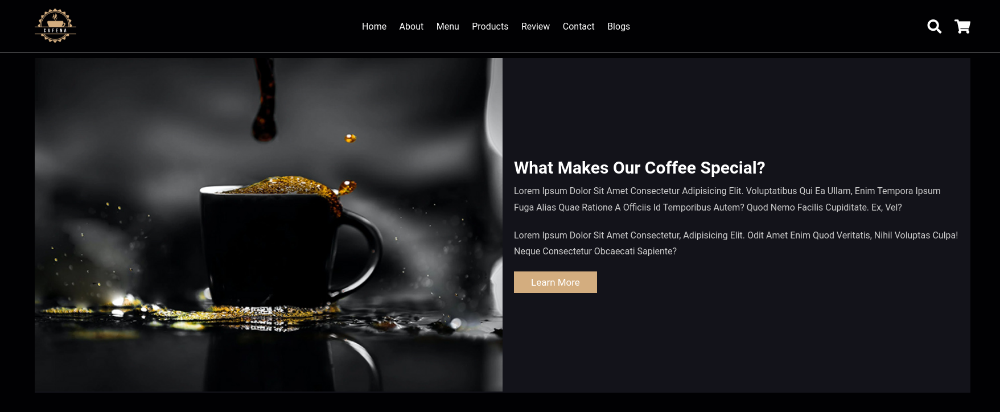
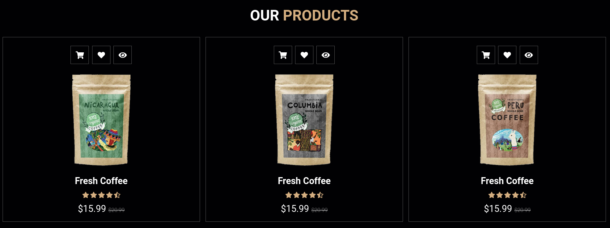
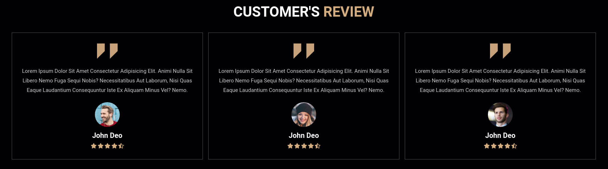

<h1 align="center">
  <a href="https://samucatezu.github.io/coffeeCommerce/">Site do programa :coffee: </a>
</h1>

<h1 align="center" ">
  Home page
</h1>

<h1 align="center" style="display: grid;">
  
</h1>

<h1 align="center">
  Product section
</h1>

<h1 style="display: flex;" align="center">
  
</h1>

<h1 align="center">
   customer review
</h1>

<h1 style="display: flex;" align="center">
  
</h1>

 

## 🚀 Tecnologias
Projeto desenvolvido com as seguintes tecnologias:

- CSS
- HTML5
- JavaScript
- Google Maps                                                                                                                               
                                                                  
<a href="https://www.youtube.com/watch?v=TVFu4-Kd4oM">Tutorial </a>
                                                                  

## 💻 Projeto

Um projeto simples para entender e obter mais conhecimento sobre reatividade e suas funcionalidades. 
